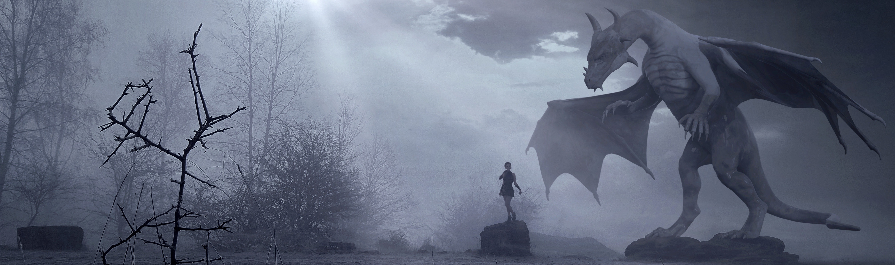

# Mrowr Purr's Skyrim Mods List

This is the (_very short_) mod list I use for my [Tuesday night streams][twitch].

> _There are no links because maintaining them is too much for me, but you can search for them by name on Nexus!_

[twitch]: https://www.twitch.tv/mrowrpurr

> Mods in **bold**, if any, are created by me

# Utilities

> These are required by a variety of mods

- SKSE64
- DLL Plugin Loader
- Papyrus Util
- Papyrus Extender
- JContainers
- ConsoleUtil
- Address Library for SKSE Plugins
- FISSES
- .NET Script Framework
- Microsoft Visual C++ Redistributable for Visual Studio 2019

# Fixes / Patches

- Achievements Enabler
- Unofficial Skyrim Patch
- SSE Engine Fixes
- Unofficial Material Fix
- Mfg Fix
- Bug Fixes SSE

# UI

- SkyUI
  - SkyUI SE - Flashing Savegames Fix
- Wider MCM Menu for SkyUI (Full screen)
- iHUD
- Racemenu
- Fuz Ro D-oh
- UI Extensions
- iWant Widgets
- Unpaused Game Menus - Skyrim Souls Updated
- Better MessageBox Controls
- Better Container Controls
- Dynamic Depth of Field
- _or McFly's Depth of Field for ENB?_
- Immersive First person View
- Quick Loot RE
- A Matter of Time
- Dear Diary
- Ye Olde MCM Settings

# Game Start

> Note: we create our own start for some playthroughs!
>
> Using either a custom Alternate Start dialogue option / quest or a Skyrim Unbound Reborn addons

- Alternate Start _or_ Skyrim Unbound Reborn

> Install Unbound after most other mods for patches

# Leveling / Perks

- Ordinator
- Experience
- **No Flames / Healing to start**

# Magic

- Apocalypse Spells

# Survival

- iNeed Continued
- Frostfall
- Campfire

# Immersion

- Paper World Map
- Touring Carriages
- Simply Knock (w/ updated DLL)
- Immersive Citizens
- Immersize Patrols
- Run for your lives
- Populated Roads
- Death Alternative - Your Money or Your Life
- Convenient Horses
- Footprints

# Character

- XP32, CBBE, CBPC, 3BA
- HIMBO
- Tempered Skin for Males
- Bijin Skin
- KS Hairs HDT (and Shiva's Vanilla Hair Replacer)
- Aesthetic Elves
- Eyes of Beauty (including elves)
- Skin Feature Overlays
- Seductive Lips
- Eyeliner Replacer
- Community Overlays 1 (0-30) Bodypaints Warpaints Tattoos and (31-50) (51-70)
- THeHAG's and BladeSinger's Private Facial Tattoos and Warpaints
- Horns Aplenty w/ HORNY

> TODO: things for beast races

# NPCs

> We may choose a follower for our playthroughs

- Interesting NPCs
- Sidequests of Skyrim
- Relationship Dialogue Overhaul

# Clothing / Armor / Weapons

- Wearable Lanterns
- Immersive Armors
- Immersive Weapons
- Racemenu High Heels
- High Heel Sound (_the version with No Sound_)
- Apachii Divine Store (and Shiva's Vanilla Clothes Replacer)
- Artesian Cloaks of Skyrim
  - Cloaks and Capes
  - Cloaks of Lace for Lady
  - Winter is Coming
  - Cloaks for Skyrim w/ Retextures w/ HDT
- ImoMegane - Glasses (_maybe_) (Oldrim)

# Weather

- Obsidian Weathers
- Storm Lightning

# Audio

- Immersive Sounds
- No Eating Noises
- **No Drinking Sounds**

# Outdoors

- Blended Roads
- Majestic Mountains
- Realistic Water Two\
- Rapid Rocks
- Flora Overhaul
- Realistic Aspen Trees
- City Trees (the JK version)
- Simply Bigger Trees
- Aspens to Cherry Blossoms

# Cities / Environment

- JK's All in One
- Immersive College of Winterhold

# Mesh Improvements

- Static Mesh Improvement Mod
- Skyrim HD
- Better Roads

# Creatures

- Diverse Dragons Collection

# ENB / Lighting

Gonna try out: A Cathedralist's ENB 2020

Or Rudy's for Obdisian but I've heard of better ones.

- ENB Light + Window Shadows
- Torches Cast Shadows
- Smoking Torches

# Combat

- Wildcat
- TK Dodge
- TK Hitstop
- Pretty Combat Animations
- 1hm and Dual Wield Animations

# Animations

- ~~Nemesis~~ FNIS
- Pretty Sit Idle
- Pretty Idle

# Misc

- Thieves Guild Requirements

# Quests

- The Notice Board
- Bounty Preview
- The Choice is Yours
- Beyond Skyrim Bruma
